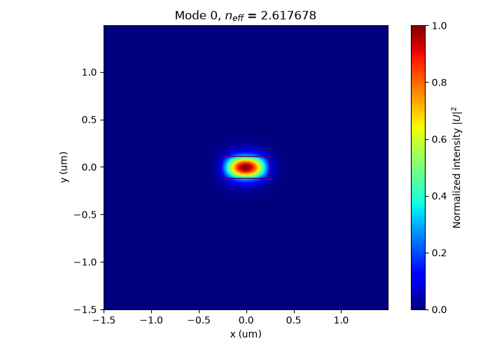
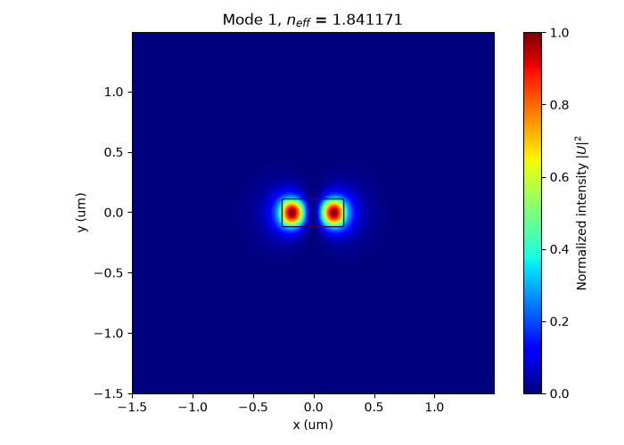

# Finite Difference Waveguide Mode Solver

<p align="center">
  
  
</p>

本專題是實驗室提供給新生的暑期練習，目標是從波導模態的基本理論出發，利用 finite difference method 建立一維與二維的 scalar waveguide mode solver。

重點是理解：

* 波導模態與 effective index 的物理意義
* scalar wave equation 如何轉成 eigenvalue problem
* finite difference 如何把微分方程離散成矩陣
* sparse matrix 與 eigensolver 的用途
* 如何判斷 guided mode、higher-order mode 與 box mode
* 如何檢查數值結果是否可信

## 如何開始

1. 先查看 Week1 內容
2. 閱讀 `theory_notes.pdf`
3. 接續 Week 2~4 內容
4. starter_code有1D以及2D程式碼參考架構
5. 在example中有關於計算上會需要使用到的程式設計概念，可直接執行查看
6. 若是你有uv的話，可以直接執行`uv sync`來使用相同的環境

---

## 1. 最終目標

完成本專題後，應能建立一個可以接受二維折射率分布 `n_profile` 的 scalar finite-difference mode solver。

### 輸入

* 真空波長 `wavelength`
* 網格間距 `dx`, `dy`
* 計算視窗大小
* 波導截面的折射率分布 `n_profile`
* 希望計算的模態數量

### 輸出

* 各模態的 effective index `neff`
* 二維 mode profile
* field amplitude 與 intensity 圖
* 網格與計算視窗的 convergence 結果

---

## 2. 專題範圍

本專題包含：

1. 一維 slab waveguide solver
2. 二維 rectangular waveguide solver
3. 利用 mask 建立不同波導截面
4. sparse finite-difference matrix
5. 利用 `eigsh()` 求解 eigenmodes
6. guided mode 與 box mode 的判讀
7. grid convergence 與 window convergence

本專題暫時不包含：

* full-vector Maxwell mode solver
* PML boundary condition
* propagation loss

目前求解的是 **scalar approximation**。對低折射率差結構可作為合理近似；對矽光子等高折射率差結構，結果主要用於理解方法與觀察定性趨勢，不應直接視為精確的 full-vector TE/TM 解。

---

## 3. 進行順序

### Week 1：理論與 finite difference

目標：

* 理解 $k_0,\beta,n_{eff}$
* 從 scalar wave equation 推導 eigenvalue equation
* 推導二維五點差分公式
* 看懂 $A^{i}、B$ block matrix

### Week 2：一維 slab waveguide solver

目標：

* 建立一維 `n_profile`
* 建立 tri-diagonal finite-difference matrix
* 求解 eigenvalues 與 eigenvectors
* 計算 $n_{eff}$
* 畫出一維 mode profile
* 重現指定 benchmark 數值

### Week 3：二維 rectangular waveguide solver

目標：

* 使用 `np.arange()` 建立 x、y 座標
* 使用 `np.meshgrid()` 建立二維座標網格
* 使用 mask 建立 `n_profile`
* 建立 sparse finite-difference matrix
* 使用 `eigsh()` 求前幾個 eigenmodes
* 計算 $n_{eff}$
* 將 eigenvector reshape 回二維 mode profile
* 畫出二維 mode profile

### Week 4：模態判讀與數值驗證

目標：

* 分辨 fundamental mode 與 higher-order mode
* 分辨 guided mode 與 box mode
* 比較 field amplitude 與 intensity
* 進行 grid convergence test
* 進行 computational-window convergence test
* 說明 scalar approximation 的限制

---

## 4. Python 環境

建議使用 Python 3.10 以上。

需要的套件：

```bash
pip install numpy scipy matplotlib
```

主要會使用：

```python
import numpy as np
import matplotlib.pyplot as plt

from scipy.sparse import diags, eye, bmat
from scipy.sparse.linalg import eigsh
```

如果你有uv，可直接把此repo clone下來並且使用`uv sync`來使用相同的環境

---

## 5. 建議程式流程

```text
設定物理與幾何參數
        ↓
建立 x、y 座標
        ↓
建立 X、Y meshgrid
        ↓
利用 mask 建立 n_profile
        ↓
建立 finite-difference sparse matrix
        ↓
利用 eigsh 求 eigenvalues / eigenvectors
        ↓
計算 neff
        ↓
將 eigenvector reshape 成 2D mode
        ↓
畫 field amplitude 與 intensity
        ↓
判斷 guided mode / box mode
        ↓
進行 convergence test
```

---

## 6. 每次執行前的檢查

### 幾何

* 核心是否位於預期位置
* 核心尺寸是否正確
* 材料折射率是否正確
* `n_profile` 是否畫出來確認過

### 矩陣

* `Ny, Nx = n_profile.shape`
* matrix shape 是否正確
* matrix 是否對稱
* 小矩陣測試是否與手算一致

### Eigensolver

* `eigsh()` 的 `k` 是否小於矩陣尺寸
* 是否使用適合的 `which`
* eigenvalues 與 eigenvectors 是否一起排序
* 是否正確計算 `neff = sqrt(eigenvalue)`

### Mode profile

* reshape 順序是否與矩陣編號一致
* 是否同時看 field amplitude 與 intensity
* 是否檢查 mode 的節點與對稱性
* 是否確認場在邊界附近足夠小

---

## 7. 常見錯誤

### 將 `Nx`、`Ny` 寫反

錯誤：

```python
Nx, Ny = n_profile.shape
```

正確：

```python
Ny, Nx = n_profile.shape
```

NumPy 二維陣列 shape 的順序是：

```text
(row, column) = (y, x)
```

### reshape 順序錯誤

若 block matrix 是先串接每一個 x-column，應使用：

```python
mode_2d = mode_vector.reshape((Ny, Nx), order="F")
```

### 把所有 eigenmodes 都當成 guided modes

`eigsh()` 只會回傳指定範圍內的 eigenpairs，不會自動判斷物理意義。

---

## 8. AI 使用原則

可以使用 AI：

* 查詢 Python 語法
* 協助排除錯誤
* 解釋 NumPy / SciPy 函數
* 改善程式結構
* 協助畫圖

但自己要能回答：

1. 這段程式對應哪個公式？
2. 輸入、輸出與用途是什麼？
3. 如何驗證結果正確？