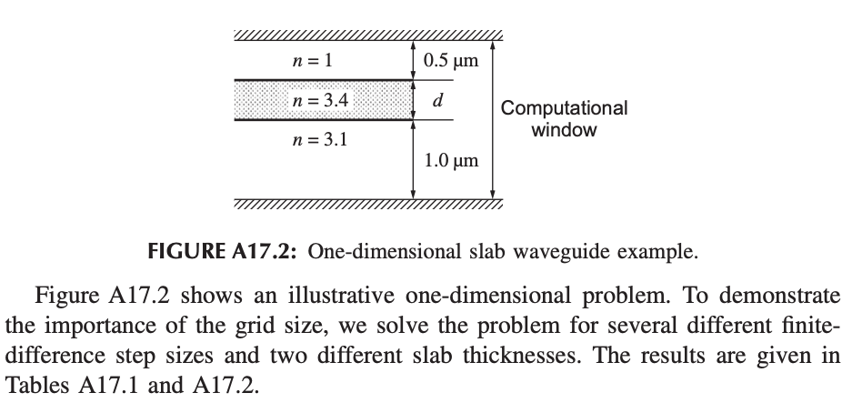
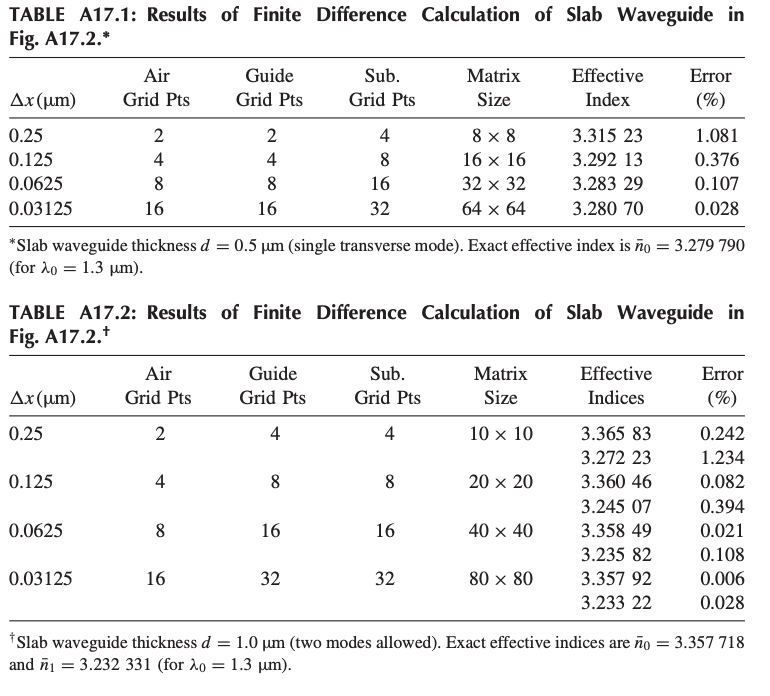

# Week 2：一維 Slab Waveguide Mode Solver

## 1. 本週目標

本週將 Week 1 的一維有限差分推導轉換成 Python 程式。

完成後，應能：

* 建立一維 slab waveguide 的折射率分布
* 建立 tridiagonal sparse matrix
* 使用 eigensolver 求解 eigenpairs
* 將 eigenvalue 轉換成 effective index
* 畫出一維 mode profile
* 與指定 benchmark 比較

---

## 2. 本週使用的檔案

請參考：

* `starter_code/starter_1d_solver.py`
* `examples/03_sparse_matrix.py`
* `examples/04_matrix_operations.py`
* `examples/05_eigenvalue_demo.py`
* `notes/theory_notes.pdf`

---

## 3. 任務一：建立折射率分布

先建立一維座標：

```python
x = np.arange(x_min, x_max, dx)
```

接著完成：

```python
def build_index_profile(
    x,
    core_width,
    n_core,
    n_clad,
    core_center=0.0,
):
    ...
```

此函數應回傳與 `x` shape 相同的 `n_profile`。

可使用 boolean mask：

```python
core_mask = np.abs(x - core_center) <= core_width / 2
```

請畫出 `n_profile`，確認：

* core 位於正確位置
* core width 合理
* core 與 cladding index 正確
* computational window 兩側具有足夠的 cladding

---

## 4. 任務二：建立有限差分矩陣

根據 Week 1 的推導，使用：

```python
scipy.sparse.diags
```

建立一維 tridiagonal sparse matrix。

請確認：

* matrix shape 為 `(N, N)`
* 主對角線包含折射率與 central-difference coefficient
* 上、下對角線代表左右鄰近網格點
* matrix 為對稱矩陣
* 對小型網格使用 `.toarray()` 檢查結構

請印出：

```python
matrix.shape
matrix.nnz
```

---

## 5. 任務三：求解 eigenpairs

使用：

```python
scipy.sparse.linalg.eigsh
```

求出數個最大的 eigenvalues 與對應 eigenvectors。

請完成：

* 將 eigenpairs 依 eigenvalue 由大到小排序
* eigenvalues 與 eigenvectors 同步排序
* 使用

```math
n_\mathrm{eff}=\sqrt{\lambda}
```

計算每個 mode 的 effective index

* 印出每個 mode 的 $n_\mathrm{eff}$

---

## 6. 任務四：畫出 mode profile

至少畫出前兩個 mode profiles。

請觀察：

* 最大 eigenvalue 對應的 mode 是否沒有 node
* higher-order mode 是否出現 sign change
* 場是否集中在 core 附近
* 場是否在 computational boundary 附近衰減

---

## 7. 任務五：重現 benchmark

使用指定參數重現教材中的一維結果。





請比較：

* 計算得到的 $n_\mathrm{eff}$
* benchmark 數值
* 網格變細後的差異
* mode profile 是否合理

---

## 8. 本週作業

* `1d_solver.py`
* 折射率分布圖
* 至少兩張 mode profile
* Table A17.1 與 A17.2 的比較結果
* 簡短結果說明

結果說明至少回答：

1. 哪一個 mode 是 fundamental-mode candidate？
2. 你如何根據 $n_\mathrm{eff}$ 與 mode profile 判斷？
3. 網格變細後，結果是否逐漸穩定？
