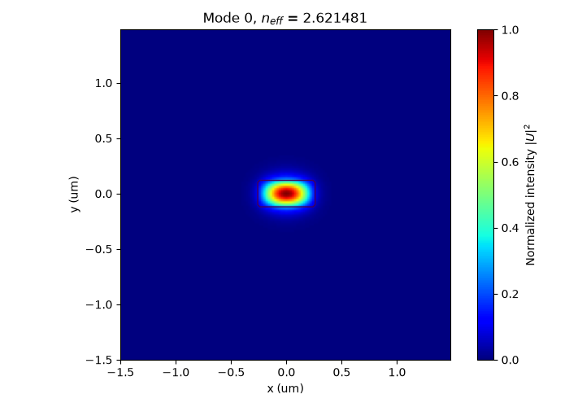
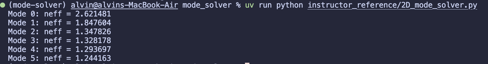

# Week 3：二維 Rectangular Waveguide Mode Solver

## 1. 本週目標

本週將一維 solver 延伸成二維 scalar waveguide mode solver。

完成後，應能：

* 建立二維座標與折射率分布
* 建立二維 finite-difference sparse matrix
* 求解數個 eigenmodes
* 將 eigenvector reshape 成二維 mode profile
* 畫出模態並進行初步判讀

---

## 2. 本週使用的檔案

請參考：

* `starter_code/starter_2d_solver.py`
* `examples/01_meshgrid_demo.py`
* `examples/02_mask_demo.py`
* `examples/03_sparse_matrix_demo.py`
* `examples/04_matrix_operations_demo.py`
* `examples/05_eigenvalue_and_reshape_demo.py`
* `notes/theory_notes.pdf`

---

## 3. 任務一：建立二維折射率分布

建立一維座標：

```python
x = ...
y = ...
```

再使用：

```python
X, Y = np.meshgrid(x, y)
```

建立二維座標。

請確認：

```python
X.shape == (Ny, Nx)
Y.shape == (Ny, Nx)
```

利用 boolean mask 建立 rectangular core，並產生 `n_profile`。

建議完成：

```python
def build_index_profile(
    X,
    Y,
    core_width,
    core_height,
    n_core,
    n_clad,
    core_center_x=0.0,
    core_center_y=0.0,
):
    ...
```

請畫出 `n_profile`，確認：

* 核心位置正確
* core width 與 core height 正確
* core 與 cladding index 正確
* `n_profile.shape == (Ny, Nx)`

---

## 4. 任務二：建立二維 finite-difference matrix

根據 lecture notes 中的 block matrix 結構，建立完整 sparse matrix。

若：

```python
n_profile.shape == (Ny, Nx)
```

則 matrix shape 應為：

```math
(N_xN_y)\times(N_xN_y)
```

完成後請印出：

```python
print(matrix.shape)
print(matrix.nnz)
```

並確認：

* 每個網格點只與自己和上下左右鄰居連接
* matrix 為 sparse matrix
* matrix 為對稱矩陣
* matrix shape 為 `(Nx * Ny, Nx * Ny)`

---

## 5. 任務三：求解 eigenmodes

使用：

```python
scipy.sparse.linalg.eigsh
```

求出數個最大的 eigenpairs。

在本專題中：

```math
\lambda=n_\mathrm{eff}^2
```

因此：

```math
n_\mathrm{eff}=\sqrt{\lambda}
```

請完成：

* 將 eigenvalues 由大到小排序
* eigenvectors 必須同步排序
* 不直接對負 eigenvalue 開平方
* 印出每個 mode 的 $n_\mathrm{eff}$

例如：

```text
Mode 0: neff = ...
Mode 1: neff = ...
Mode 2: neff = ...
```

---

## 6. 任務四：將 eigenvector reshape 成 mode profile

每一個 eigenvector 的長度為：

```math
N_xN_y
```

請將其 reshape 成：

```text
(Ny, Nx)
```

若矩陣使用 column-first 編號，可使用：

```python
mode_2d = mode_vector.reshape(
    (Ny, Nx),
    order="F",
)
```

請確認：

* mode profile 沒有被轉置
* 核心位置與場分布位置一致
* 每次畫圖時使用的是不同 eigenvector

---

## 7. 任務五：畫出模態

請至少畫出前六個 modes 的：

* field amplitude，或
* normalized intensity

並在圖上標示波導核心邊界。

對每一個 mode 記錄：

* $n_\mathrm{eff}$
* 場是否集中在核心
* 是否有明顯 node 或 nodal line
* 是否可能是 guided-mode candidate

本週只需進行初步判讀，完整分類與 convergence analysis 留到 Week 4。

應該會得到類似這樣的結果：





---

## 8. 本週作業

請使用以下參數：

```python
wavelength = 1.55

# 計算視窗的大小
window_width = 3.0
window_height = 3.0
# 網格大小 (在一開始設計時可以設定較大，計算速度快，需要更精細再調低)
dx = 0.02
dy = 0.02

core_width = 0.5
core_height = 0.22

n_core = 3.48
n_clad = 1.44
```


* `2d_solver.py`
* 折射率分布圖
* 前六個 mode profiles
* 各 mode 的 $n_\mathrm{eff}$
